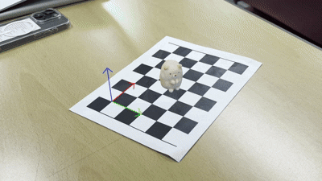

# sumikkogurashi pose estimation

체스보드를 기반으로 카메라 포즈를 추정하고, 고양이 3D 모델을 AR로 합성하는 프로젝트입니다.

## 데모

## 동작 원리

### 1. 카메라 캘리브레이션
- 입력 영상에서 10프레임 간격으로 최대 20장의 체스보드 이미지를 추출합니다.
- `cv.calibrateCamera`로 카메라 내부 파라미터(K)와 왜곡 계수를 계산합니다.

### 2. 3D 모델 로딩
- GLB 파일에서 메시(vertices, faces)와 UV 텍스처 색상을 추출합니다.
- X축 기준 -90° 회전 후 체스보드 셀 크기에 맞게 스케일링합니다.
- 모델 하단(발바닥)을 보드 표면(z=0)에 정렬하고 체스보드 중앙 좌표로 이동시킵니다.

### 3. AR 렌더링
- 매 프레임마다 `cv.findChessboardCorners`로 체스보드 코너를 검출합니다.
- 코너 순서를 정규화하여 좌표계 방향을 일관되게 유지합니다.
- `cv.solvePnP`로 카메라 포즈(rvec, tvec)를 추정합니다. 이전 프레임의 포즈를 초기값으로 사용해 안정성을 높입니다.
- 3D 메시를 Painter's Algorithm으로 정렬 후 `cv.fillPoly`로 래스터라이징합니다.

## 체스보드 설정

| 항목 | 값 |
|------|-----|
| 내부 코너 수 | 7 × 5 |
| 셀 크기 | 25mm |

